# Cinema Paradiso

> **Local-first movie archive command console** for Plex collectors, large Windows libraries, TMDB discovery, Prowlarr source search, and Ollama-backed recommendations.

Cinema Paradiso is a self-hosted movie library manager for people with hundreds or thousands of local movie files. It helps you browse what you own, clean duplicates and low-quality copies, fix unmatched metadata, discover movies online, search torrent indexers, stream titles, and ask a local AI curator what to watch.

Your library catalog, settings, and operational state stay on your machine. Optional services such as Plex, TMDB, Prowlarr, streaming providers, and Ollama cloud models are contacted only when configured for their corresponding features.

**Current release: v2.8.0** - July 2026

---

## Screenshots

### Home Command Center

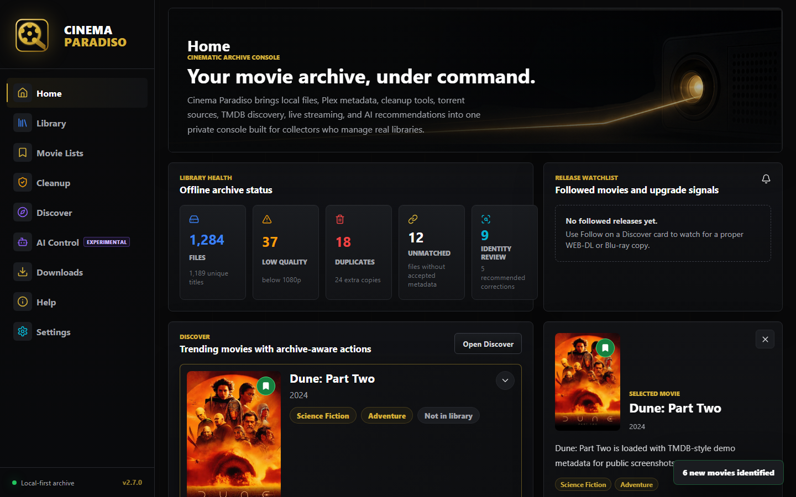

### Library

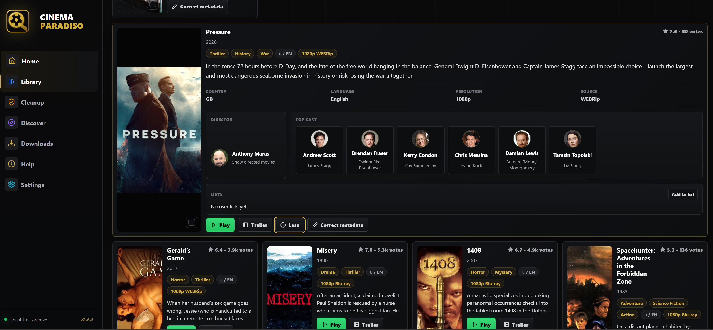

### Library File View

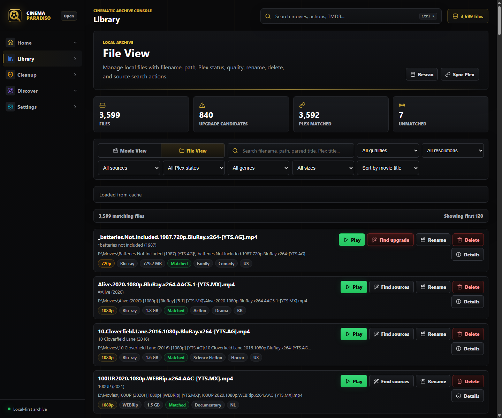

### Movie Lists

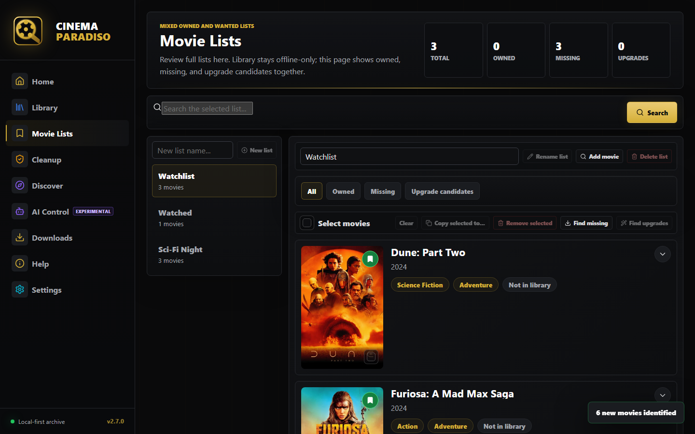

### Cleanup

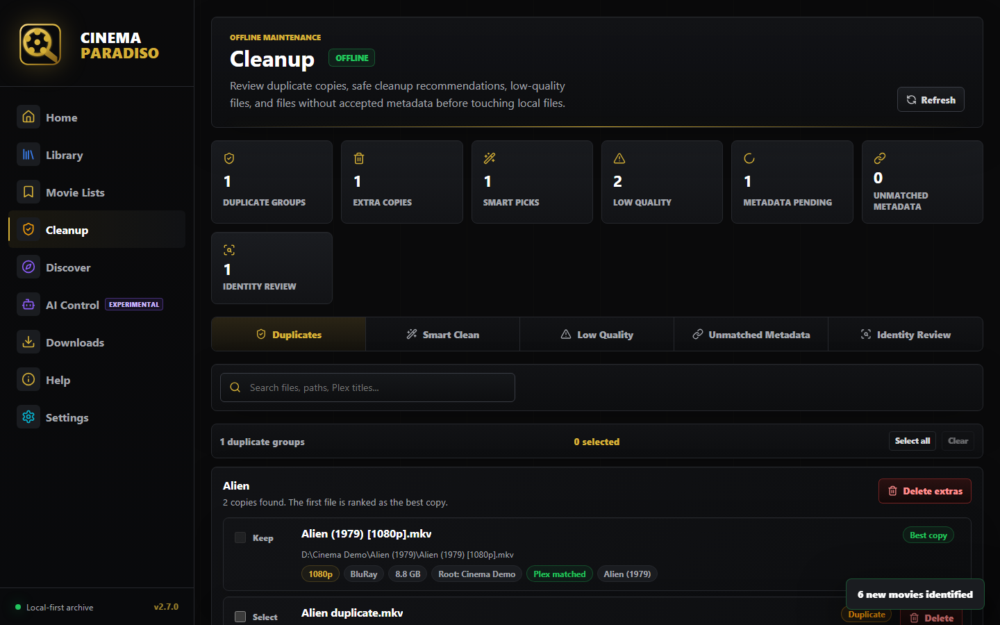

### Identity Review

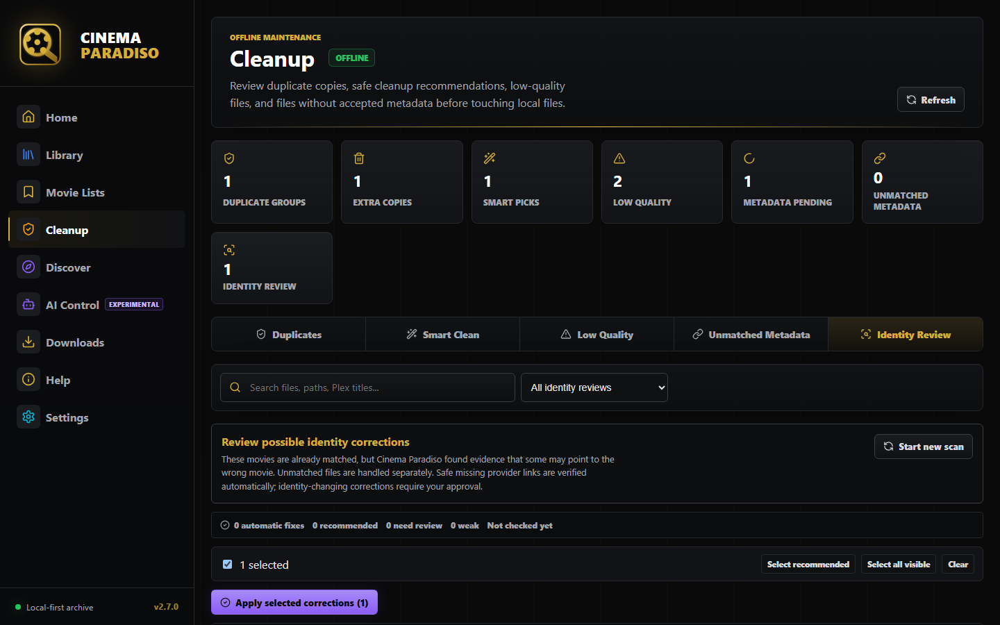

### Discover Movies

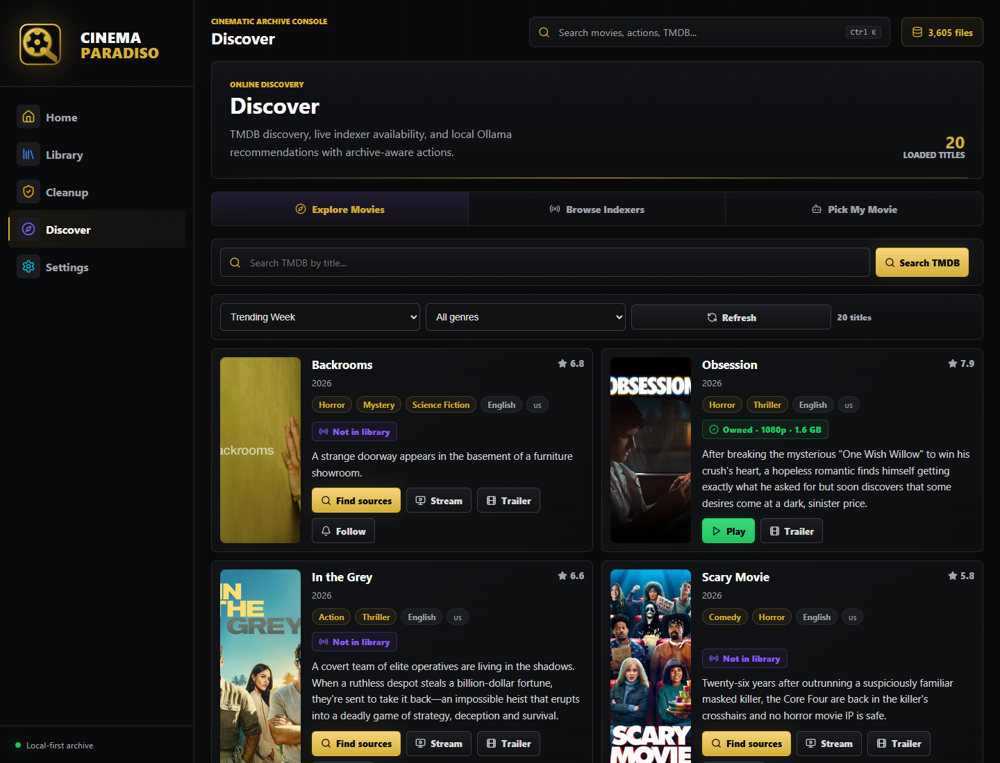

### Browse Indexers

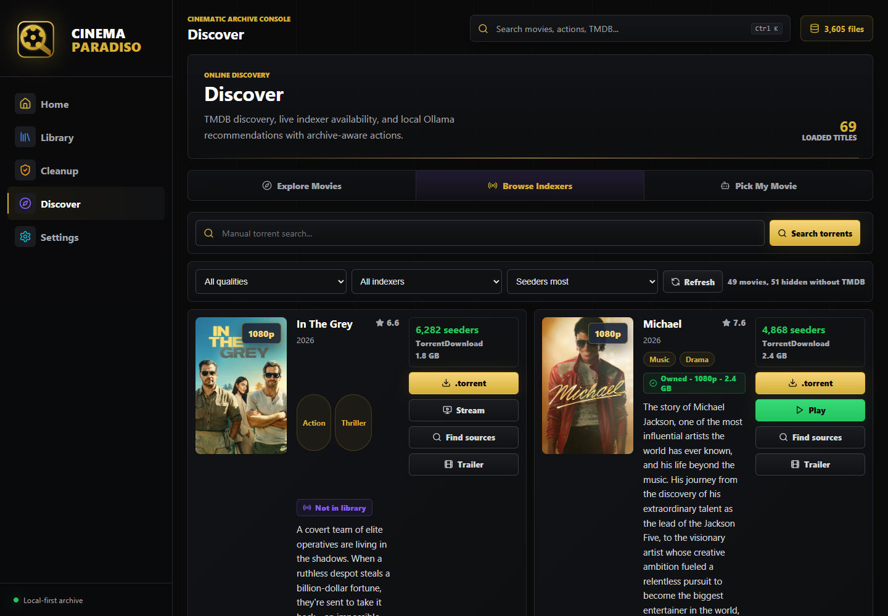

### Ask AI

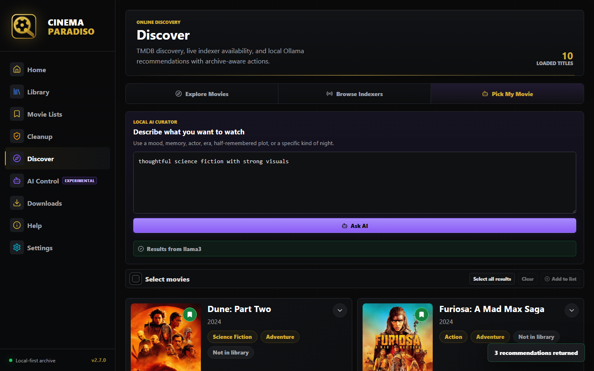

### AI Control

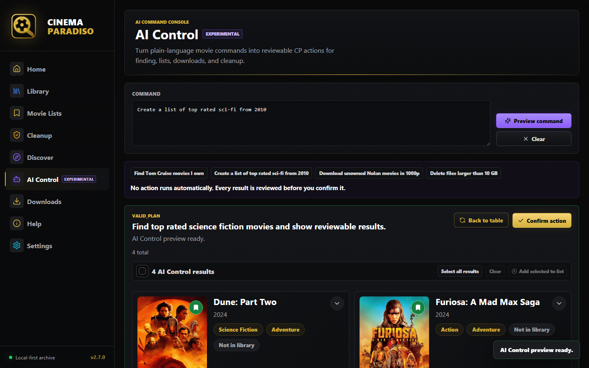

### Downloads

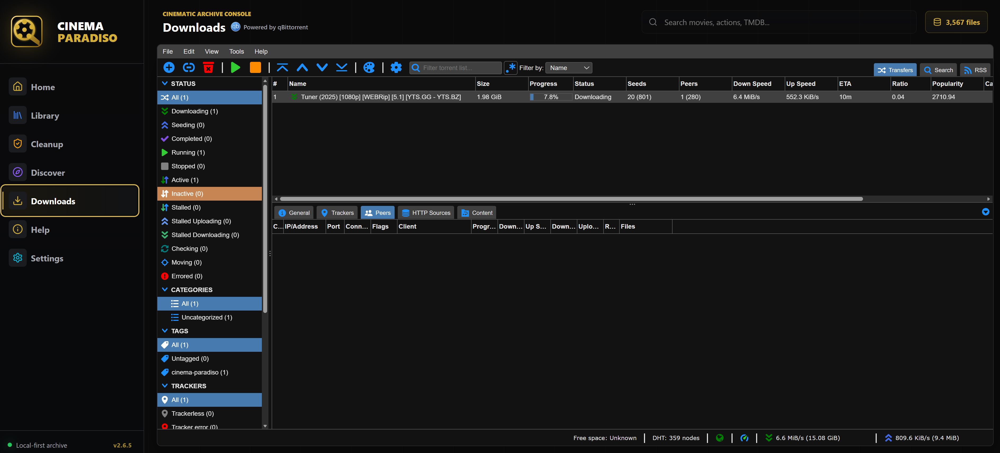

### Help

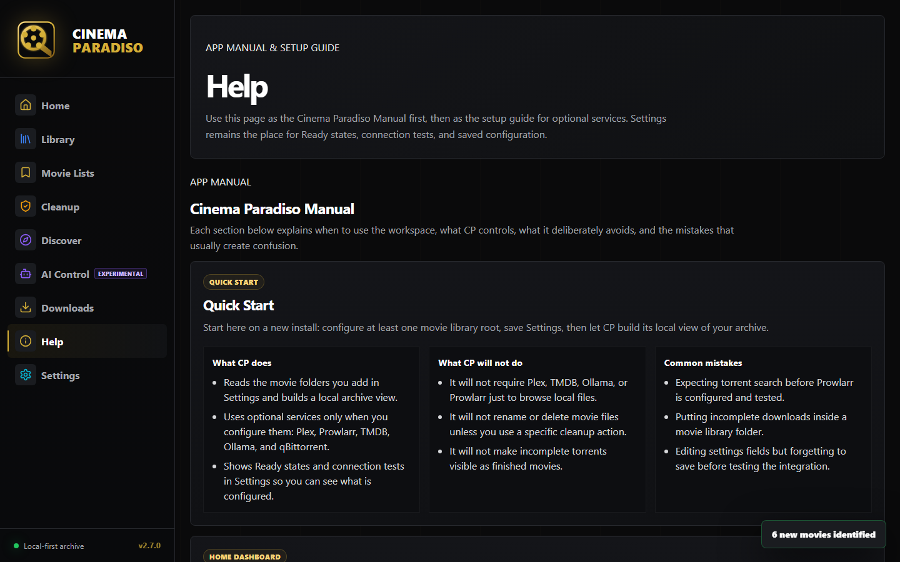

### Settings

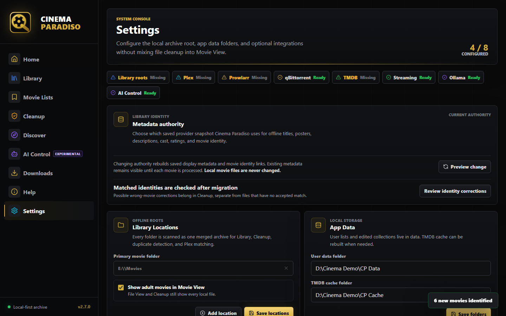

### Styleguide

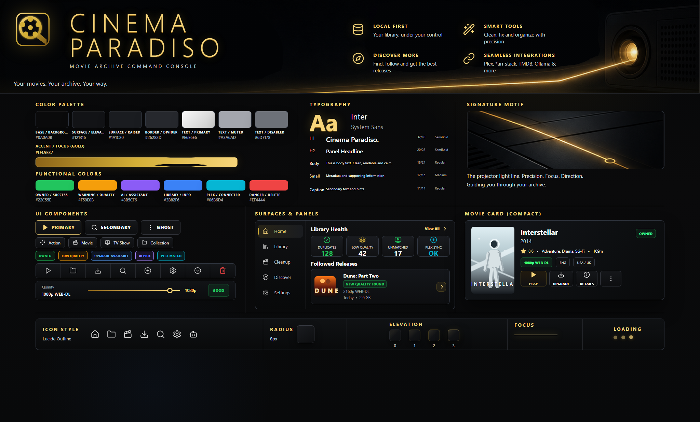

---

## What Changed in v2.8.0

Cinema Paradiso v2.8.0 completes the SQL catalog cutover, adds bounded catalog reads and durable local artwork, and introduces a separated, provider-agnostic IPTV workspace.

- **SQL catalog parity:** active workflows now use the SQL catalog authority with generation-aware invalidation and legacy JSON retained only for rollback and shadow comparison.
- **Consistent ownership:** Library, Discover, and Movie Lists refresh shared ownership state when the catalog generation changes.
- **Persisted expanded details:** Library expanded cards load canonical SQL metadata instead of depending on transient frontend projections.
- **Download identity handoff:** torrent submissions preserve TMDB and IMDb identity through completion and catalog reconciliation.
- **Recoverable imports:** completed qBittorrent jobs can be replayed and audited when an earlier import did not finish cleanly.
- **Parity evidence:** migration matrices, catalog audit tools, shadow comparisons, and focused regression tests document the SQL cutover.
- **Bounded catalog reads:** Library paging, filtering, sorting, facets, selection, and owned details now execute through bounded SQL projections instead of full-library route reads.
- **Durable local artwork:** selected owned posters and people portraits are stored in the local metadata directory with checksum deduplication, resumable backfill, and custom-poster protection.
- **Separated IPTV workspace:** Xtream live TV, movies, series, Favorites, and provider-scoped lists remain independent from the local movie catalog and torrent workflows.
- **Version display:** the sidebar footer is rebuilt from the `2.8.0` package version so the app UI matches the release tag.

---

## What Changed in v2.7.0

Cinema Paradiso v2.7.0 adds an experimental AI Control workspace for review-first library actions while preserving the v2.6 source-search, qBittorrent, movie-card, trailer, streaming, identity-review, and metadata-repair foundations.

- **AI Control workspace:** a new sidebar workspace turns plain-language requests into reviewable plans for finding movies, creating lists, planning downloads, and cleanup.
- **Review-first execution:** AI Control separates preview from execute, requires explicit confirmation for destructive actions, and rejects delete execution if a file changed after preview.
- **Safer download planning:** AI Control uses trusted Prowlarr indexers, defaults to YTS/YIFY when no trusted source is configured, and skips movies already owned.
- **Reusable movie cards:** AI Control find results can switch between table and card views and preserve card-ready TMDB/Plex metadata for Discover-style cards and list actions.
- **Better prompt handling:** vague or malformed prompts return clarification or safe no-match results instead of failing the request.
- **Large delete guardrails:** high-risk delete plans require a confirmation phrase before execution.
- **Version display:** the sidebar footer is rebuilt from the `2.7.0` package version so the app UI matches the release tag.

---

## Core Workspaces

### Home

The Home page is the command center. It shows library health, unmatched and identity-review counts, followed release alerts, trending movies, and a selected movie detail panel. Health cards open the exact Cleanup queue that needs attention. The release watchlist is intentionally compact: the Home widget shows only slim rows, while `View all` opens the full followed list.

### Library

Library is the offline archive browser.

- **Movie View:** for choosing what to watch from files with accepted metadata.
- **File View:** for managing every local video file, including files without accepted metadata.
- Filters include quality, resolution bucket, source, genre, language, country, year, rating, Plex state, viewing state, and size.
- Actions include Play, Find Sources, Find Upgrade, Trailer, Rename, Delete, metadata correction, poster editing, Watched, Watchlist, Add to List, and collection/list filtering.
- A forced library scan reconciles stable files that do not yet have metadata records.

### Cleanup

Cleanup is the safe maintenance area for local files.

- Duplicates
- Smart Clean recommendations
- Low-quality files
- Unmatched Metadata fixes
- Identity Review for uncertain matches, provider conflicts, and metadata discrepancies
- Rename, Fix Path, TMDB match, optional Plex match, source search, and Recycle Bin delete flows

Identity Review scans can be paused and resumed. Metadata changes require explicit selection and confirmation. Destructive actions are explicit and confirmed, and Delete defaults to the Windows Recycle Bin.

### Discover

Discover is the online activity area.

- **Explore Movies:** TMDB lists, genres, search, trailers, stream, sources.
- **Browse Indexers:** Prowlarr latest/search results with selectable indexer source, resolution, seeders, size, and direct submission to the embedded qBittorrent client.
- **Pick My Movie:** local Ollama recommendations enriched with TMDB metadata and archive-aware actions.
- **AI Control handoff:** AI-created find and list results reuse the same card-ready metadata and list workflows used by Discover.

### AI Control

AI Control is an experimental review workspace for natural-language commands.

- Supports find, create-list, download-planning, and delete-planning flows.
- Shows a preview plan before any action runs.
- Requires reviewed plan IDs for execution and extra confirmation for large delete plans.
- Uses trusted Prowlarr indexers for download planning.
- Keeps blocked rows visible with the reason they were blocked.
- Never runs a vague command automatically; it asks for clarification.

### Downloads

Downloads uses the original qBittorrent WebUI inside Cinema Paradiso. The embedded client is isolated from any qBittorrent installation already registered as the operating system's default torrent client.

- The current public v2.7.0 portable release ZIP includes a tested bundled qBittorrent runtime.
- Cinema Paradiso submissions are tagged `cinema-paradiso` and download to an incomplete staging folder.
- Removing an unfinished CP submission in qBittorrent is treated as a normal cancellation; CP does not move its data or update the catalog.
- At 100%, Cinema Paradiso pauses and removes the torrent without deleting its data, then moves the unchanged payload into the selected movie destination.
- A blank movie destination uses the first configured library folder.
- The incomplete folder must remain outside every movie library so Plex and Cinema Paradiso cannot index partial files.
- Settings can switch torrent handling back to the operating system's default client.
- Cinema Paradiso 2.8 Settings can update the isolated portable qBittorrent runtime from the latest official GitHub release without installing or changing the system torrent client.

### IPTV

IPTV is a provider-agnostic Xtream workspace introduced for v2.8 development. It is deliberately separate from the owned Cinema Paradiso catalog.

- Supports one active Xtream provider with Live TV, Movies, Series, Favorites, provider-scoped custom lists, watch history, and provider categories in provider order.
- Stores the provider catalog in a separate `data/iptv/iptv.sqlite` database. IPTV titles never become owned library records.
- Keeps IPTV Favorites and custom lists separate from Cinema Paradiso Movie Lists, with mixed channels, movies, and series plus manual ordering.
- Retains a saved item's title and artwork when it disappears from the current provider catalog, while marking it unavailable instead of silently deleting it.
- Keeps saved credentials on the Flask backend and returns only redacted configuration state to React.
- Loads movie and series details lazily from the provider, including Arabic text without requiring Ollama or another AI service.
- Uses tokenized local playback sessions. FFmpeg receives a loopback URL rather than the credential-bearing Xtream URL.
- Remuxes provider streams to local HLS without transcoding by default. Unsupported source codecs can still fail in the browser.
- Cinema Paradiso does not provide IPTV subscriptions or content. Users connect their own authorized provider account in Settings.

### Help

Help is the static setup guide for optional dependencies. It explains why Plex, Prowlarr, TMDB, Ollama, and qBittorrent may be useful, links to official downloads/docs, describes where to find tokens or API keys, and provides shortcuts back to the matching Settings cards. Settings remains the only place that shows Ready/Missing states and runs connection tests.

### Settings

Settings manages:

- Movie library folders
- User data folder
- TMDB cache folder
- Plex URL/token
- Prowlarr URL/API key
- Embedded or system torrent handling
- Completed movie destination and incomplete download folder
- TMDB API key
- Xtream IPTV server and credentials
- Ollama URL/model

User lists, Watched and Watchlist states, edited collections, followed releases, manual metadata matches, metadata corrections, identity audit state, and poster overrides are persistent user data. TMDB detail caches are rebuildable cache.

---

## Requirements

- Windows 10/11 x64 for the bundled qBittorrent portable release
- Python 3.10+
- Node.js 18+ for building the React frontend
- Optional: Plex Media Server
- Optional: Prowlarr
- Optional: TMDB API key
- Optional: Ollama
- Optional: Xtream IPTV subscription
- FFmpeg for integrated IPTV playback (bundled when supplied to the v2.8 portable release builder)

---

## Installation

### Windows Quick Start

For normal use, download the `Cinema-Paradiso-2.7.0-Portable.zip` artifact from GitHub Releases, extract it, and run Cinema Paradiso from that folder. The portable release includes the tested bundled qBittorrent runtime.

The GitHub Source ZIP remains developer-oriented. If you download the source ZIP or clone the repository, double-click `run.bat`.

The launcher creates `.venv`, installs Python dependencies, installs frontend dependencies, builds the React app when `dist/` is missing, starts Flask, and opens [http://localhost:5000](http://localhost:5000).

### Manual Setup

```bash
git clone https://github.com/dantebagera/cinema-paradiso.git
cd cinema-paradiso
pip install -r requirements.txt
npm install
npm run build
```

Then start the Flask app:

```bash
python app.py
```

Open [http://localhost:5000](http://localhost:5000).

---

## Configuration

Settings are saved in `config.json`, which is intentionally ignored by git.

Example:

```json
{
  "movies_dir": "E:\\Movies",
  "movies_dirs": ["E:\\Movies", "F:\\Archive"],
  "plex_url": "http://localhost:32400",
  "plex_token": "your-token",
  "prowlarr_url": "http://localhost:9696",
  "prowlarr_key": "your-api-key",
  "tmdb_key": "your-tmdb-key",
  "ollama_url": "http://localhost:11434",
  "ollama_model": "llama3",
  "user_data_dir": "C:\\Path\\To\\CinemaParadiso\\data",
  "tmdb_cache_dir": "C:\\Path\\To\\CinemaParadiso\\cache",
  "qbt_mode": "embedded",
  "qbt_download_dir": "",
  "qbt_incomplete_dir": "",
  "qbt_webui_port": 8686
}
```

Only a movie library folder is required. Integrations are optional.

The public v2.7.0 portable release uses bundled qBittorrent. Cinema Paradiso 2.8 keeps the embedded runtime portable and adds a user-triggered update control in Settings. Torrent mode and completed/incomplete folders remain configurable.

---

## Local Data and Cache

The app separates persistent user data from rebuildable cache:

- `data/` stores user lists, viewing states, edited collections, followed releases, poster overrides, metadata corrections, identity audit state, app metadata records, the isolated IPTV database/provider configuration, and the isolated qBittorrent profile/jobs when the default user data folder is used.
- `runtime/` in the portable release stores bundled third-party runtimes such as qBittorrent and FFmpeg.
- `cache/` stores rebuildable TMDB detail/collection cache.
- `res_cache.json` stores local resolution probe cache.
- `config.json` stores local settings and secrets.

These files are user-specific and should not be committed.

---

## Safety

- File deletes default to Windows Recycle Bin via `send2trash`.
- Permanent deletion is treated as dangerous and must be explicit where exposed.
- File operations are restricted to configured movie library roots.
- Cleanup workflows show paths and affected files before action.
- Torrent-file retrieval is restricted to the configured Prowlarr origin; arbitrary browser-supplied download URLs are rejected.
- IPTV images can only be fetched through URLs already stored in the provider catalog; the browser cannot supply an arbitrary proxy URL.
- IPTV stream credentials remain behind a tokenized loopback relay and are not placed in browser or FFmpeg command-line URLs.
- Completed downloads are never renamed automatically.

---

## Tech Stack

- **Backend:** Python, Flask
- **Frontend:** React 19, Vite, CSS custom properties
- **Icons:** Lucide React
- **Metadata:** Plex API, TMDB API
- **Source search:** Prowlarr API
- **Downloads:** qBittorrent WebUI API and original qBittorrent WebUI
- **AI:** Ollama local chat API
- **Resolution probing:** pymediainfo
- **Delete safety:** send2trash

Cinema Paradiso v2.6 uses the React frontend as the only public interface.

---

## Development

Run the frontend dev server:

```bash
npm run dev
```

Build the frontend for Flask:

```bash
npm run build
```

Run the Flask backend:

```bash
python app.py
```

Basic verification:

```bash
python -m py_compile app.py
python -m unittest discover -s tests -p "test_*.py"
node --test tests/discoverUtils.test.mjs
npm run build
```

---

## License

MIT
