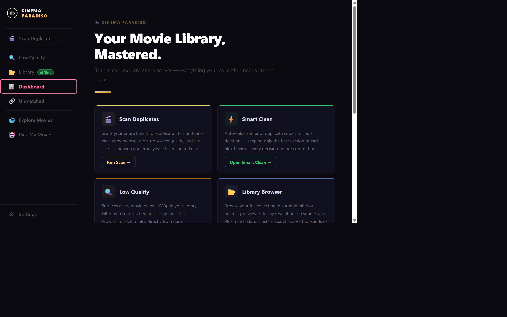
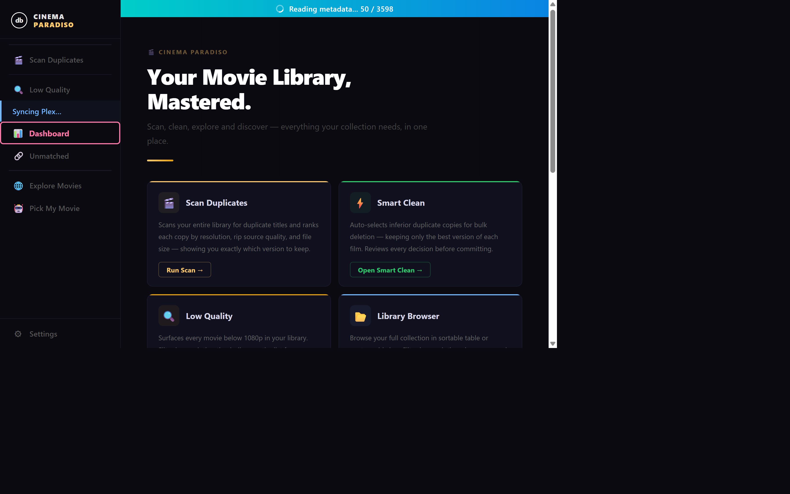
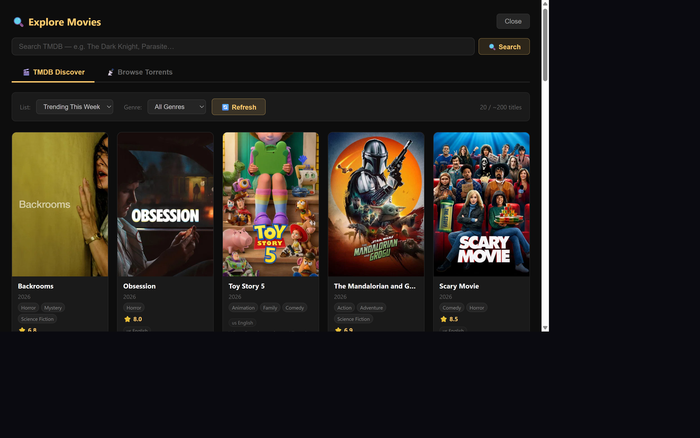
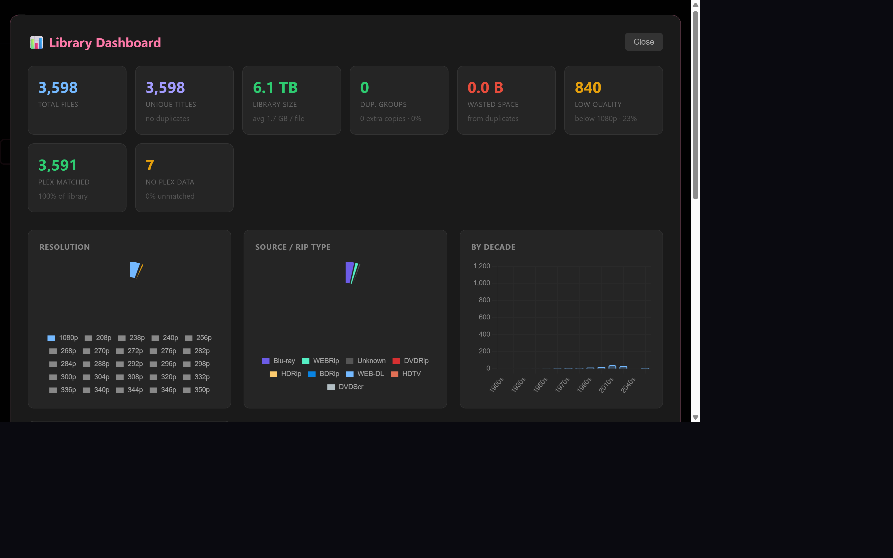
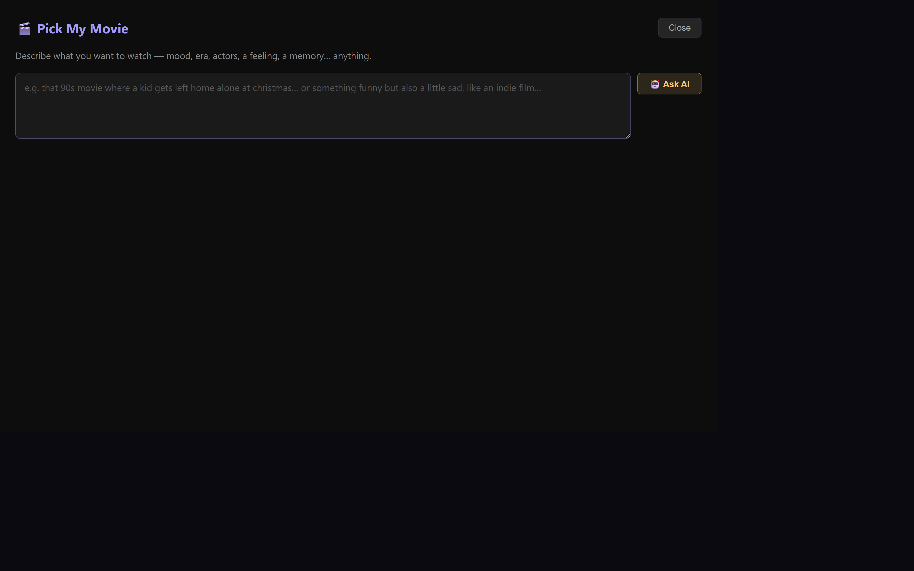
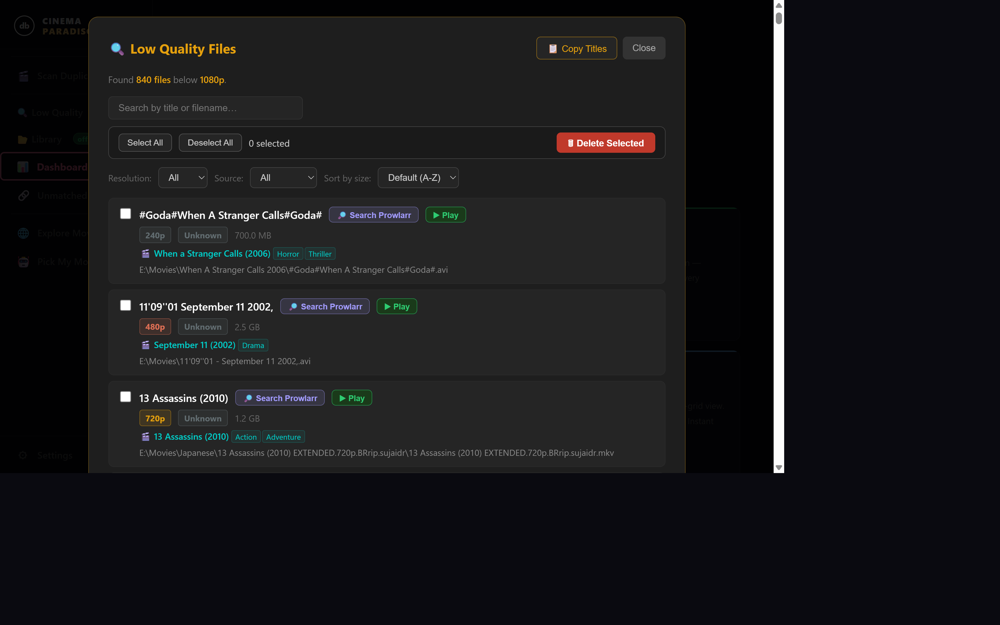

# 🎬 Cinema Paradiso

> **Self-hosted movie library manager** · **Plex duplicate cleaner** · **AI movie recommendations** · **TMDB movie discovery** · **Local Plex organizer for Windows**

A local web application for managing, discovering, and perfecting a large Plex movie library on Windows. Runs entirely on your own machine — no cloud, no subscriptions, no data leaves your PC.

Built with Python + Flask. Designed for libraries with thousands of files — tested with 10,000+ movies.

**Current version: v2.0** — June 2026

---

## Screenshots

### Home — Cinematic Dashboard



### Library Browser — 3,598 files, 100% Plex matched



### Explore Movies — TMDB Discovery + Torrent Search



### Dashboard — Live Library Statistics



### Pick My Movie — AI Recommendations via Ollama



### Low Quality Scanner



---

## What is Cinema Paradiso?

Cinema Paradiso started as a duplicate scanner and evolved into a complete **personal movie library command centre**. It handles every part of owning a large local movie collection:

- **Cleaning** — find and remove duplicate copies, low-quality files, and Plex-unmatched stragglers
- **Browsing** — your entire library in a fast searchable/sortable table or poster grid
- **Discovering** — explore TMDB trending lists, top-rated films, genres, and find torrents for anything
- **Recommending** — describe a mood or memory to your local Ollama AI and get 5 personalised picks
- **Playing** — open any file in your default video player directly from any panel

Everything runs locally. No accounts. No cloud. No subscriptions.

---

## What problems does this solve?

- **"My Plex library has hundreds of duplicate movies"** — the Duplicate Scanner finds every film you own more than once and ranks each copy by resolution, rip source, and file size so you always know which one to keep.
- **"Plex won't match some of my movies"** — the Unmatched Panel finds files buried in deep subfolder structures that Plex can't identify, and lets you fix the path or manually match them.
- **"I have hundreds of 720p/480p movies I want to replace"** — the Low Quality Scanner lists every sub-1080p file so you can prioritise upgrades and bulk-copy titles to Prowlarr.
- **"I want to browse my library without opening Plex"** — the Library Browser gives you a fully searchable, sortable table or poster grid of every file with metadata, resolution, rip source, and Plex status.
- **"I want to discover new movies and find torrents without leaving the app"** — Explore Movies gives you TMDB trending lists, genre discovery, poster cards with ratings and plots, and direct Prowlarr torrent search.
- **"I can't decide what to watch"** — describe your mood to your local Ollama AI (Pick My Movie) and get 5 personalised film picks with posters, ratings, and a reason why each fits. If you already own a pick, it shows a green badge and a Play from HDD button.

---

## Features

| Feature | Description |
|---|---|
| 🎬 **Scan Duplicates** | Finds every movie you own more than once. Ranks copies by resolution, rip source, and size so you always know which version to keep |
| ⚡ **Smart Clean** | One-click automated recommendations — safely flags inferior duplicates for deletion without touching anything you should keep |
| 🔍 **Low Quality Scanner** | Lists every file below 1080p so you can find and replace your worst-quality movies |
| 📂 **Library Browser** | Full table or poster-grid view of your entire library with search, filters, sort, play, rename, and bulk delete. Virtual scroll stays instant even with 3,000+ files |
| 📊 **Dashboard** | Library statistics with charts — resolution breakdown, rip source distribution, movies by decade, biggest files, and Plex coverage |
| 🎬 **Plex Integration** | Cross-references your files with Plex metadata. Shows Plex title, year, and genres on every file. Duplicate grouping uses Plex identity (TMDB/TVDB), not just filenames |
| 🔗 **Unmatched Panel** | Finds files Plex can't identify. Fix Path moves them to where Plex finds them; Rename cleans the filename; Match lets you manually link a Plex entry |
| 🌐 **Explore Movies** | Full TMDB discovery suite — trending lists, genre filters, poster cards with ratings and plots, find torrents across all Prowlarr indexers, stream any movie |
| 🤖 **Pick My Movie** | Describe a mood, memory, or theme to your local Ollama AI — get 5 personalised picks with posters, genres, ratings, and a one-sentence reason. Green badge + Play button if you already own the film |
| ▶ **Play Anywhere** | Every file in every panel has a Play button — opens in VLC, MPC-HC, or any system default player |

---

## What's New in v2.0

### 🎨 Cinema Paradiso — Full UI Redesign

The entire interface has been rebuilt with a cinematic dark aesthetic:

- **New name:** Cinema Paradiso
- **Sidebar navigation** replaces the old top button bar — a fixed 220px left panel with icon+label nav items, per-feature accent colours on hover, and a two-line logo wordmark
- **Cinematic home screen** — bold hero heading, gold accent line, and 8 feature cards in a responsive grid. Each card has a colour-coded 2px top bar, icon badge, 2–3 sentence feature description, and a direct action button
- **Deep dark background** (`#0a0a10`) throughout — near-black canvas with subtle card surfaces
- **Per-feature colour identity:** Scan Duplicates (gold), Smart Clean (green), Low Quality (orange), Library (blue), Dashboard (pink), Unmatched (purple), Explore (gold), Pick My Movie (purple)

### 🤖 Pick My Movie — AI Film Recommendations (Ollama)

A new full-screen panel powered by your local Ollama installation:

- Type anything — a mood, a decade, an actor, a half-remembered plot — and press **🤖 Ask AI**
- Ollama returns 5 picks with a one-sentence reason for each
- Cards enriched with TMDB: poster, genres, rating, and plot
- **"In Your Library" detection:** the app checks your local movie folder after results arrive. If you already own a pick, the card shows a green **✓ In Your Library · 1080p · 2.4 GB** badge and a **▶ Play from HDD** button — Stream button hidden
- Find Torrent on every card for immediate Prowlarr search
- Ctrl+Enter submits the prompt
- Requires [Ollama](https://ollama.ai) running locally — free, no API key

### 🌐 Explore Movies — Full Discovery Suite

- **Global TMDB Search** — search any title, browse results as poster cards with Load More
- **TMDB Discover** — 6 curated lists (Trending Today, Popular, Now Playing, Top Rated, Upcoming, Best of All Time) with 15 genre filters and Load More
- **Browse Indexers** — latest torrents from all Prowlarr indexers as poster cards with TMDB metadata, resolution variant pills, and filter by quality/indexer/sort
- **Find Torrent modal** — per-movie: all 1080p+/4K results across every indexer
- **▶ Stream** — one click to stream any movie via free streaming service

---

## Earlier Version Highlights

<details>
<summary>v1.17 — Rename in Library, Prowlarr improvements</summary>

- Every Library row has a **✎ Rename** button — modal pre-filled with detected title and year; row updates in-place after saving
- Renaming busts the server-side library cache immediately
- Prowlarr now queries **all** enabled indexer IDs explicitly; result limit raised to 1000
- Fixed quote-escaping bug that broke the Prowlarr search button in Library rows

</details>

<details>
<summary>v1.16 — Plex-metadata duplicate detection, Fix Path improvements</summary>

- Duplicate Scanner groups by **Plex-resolved TMDB/TVDB identity** — catches duplicates with completely different filenames
- Plex bulk mis-match guard (>4 files in same Plex group falls back to filename grouping)
- Fix Path moves the **entire containing folder** one level up, preserving the folder name Plex uses as a metadata hint
- **Fix All Paths** button — runs Fix Path on every eligible file in one click with live progress

</details>

<details>
<summary>v1.15 — Play buttons, Manual Rename in Unmatched</summary>

- **▶ Play** button in every panel row — opens file in system default player via `/api/open-file`
- **✎ Rename** button in Unmatched panel with quality tags auto-appended

</details>

<details>
<summary>v1.11 — Real resolution detection, Virtual scroll, Library cache</summary>

- Real video stream resolution via **pymediainfo** — files without filename tags now show true resolution, results cached in `res_cache.json`
- Library Browser virtual scroll — instant for 3,600+ files
- Library result cached server-side for 5 minutes with live scan progress

</details>

---

## Who is this for?

- Plex users with a **large local movie collection** (hundreds to tens of thousands of files)
- Anyone who has accumulated **duplicate files** over years of downloading
- Users whose **Plex library has unmatched or unidentified files**
- People who want to **discover movies and find torrents** without leaving their library tool
- Users who want **AI-powered recommendations** from a local Ollama model
- Anyone who wants a **self-hosted, offline-first** library manager

> **Related searches:** Plex movie library cleaner · Plex duplicate finder · fix Plex unmatched movies · bulk delete Plex duplicates · self-hosted movie discovery · local AI movie recommendations · Ollama movie picker · TMDB movie browser · Prowlarr movie search · find low quality movies in Plex · movie folder cleanup Windows

---

## Requirements

- Python 3.10+
- Windows 10/11
- [Plex Media Server](https://www.plex.tv/) *(optional — metadata enrichment and Plex-based duplicate grouping)*
- [Prowlarr](https://prowlarr.com/) *(optional — torrent searching across all panels)*
- [TMDB API key](https://www.themoviedb.org/settings/api) *(optional — free, for Explore Movies and Pick My Movie metadata)*
- [Ollama](https://ollama.ai) *(optional — free, for Pick My Movie AI recommendations)*

---

## Installation

```bash
git clone https://github.com/dantebagera/10k-movie-library-organizer.git
cd 10k-movie-library-organizer
pip install -r requirements.txt
```

---

## Usage

**Windows — double-click `run.bat`**

Or manually:

```bash
python app.py
```

Then open **http://localhost:5000** in your browser.

---

## Configuration

All settings are saved from the ⚙ Settings panel in the app. They persist to `config.json`:

```json
{
  "movies_dir": "E:\\Movies",
  "plex_url": "http://localhost:32400",
  "plex_token": "your-token-here",
  "prowlarr_url": "http://localhost:9696",
  "prowlarr_key": "your-api-key-here",
  "tmdb_key": "your-tmdb-api-key",
  "ollama_url": "http://localhost:11434",
  "ollama_model": "llama3"
}
```

Only `movies_dir` is required. Everything else is optional.

---

## Delete Safety

- **Recycle Bin mode** (default) — moves files to the Windows Recycle Bin via `send2trash`. Fully recoverable.
- **Permanent mode** — irreversible. Toggle is clearly labelled.
- The app only deletes files inside your configured `movies_dir`. Any path outside it is rejected.

---

## How It Works

**Duplicate detection** extracts a normalised `(title, year)` key from each filename. When Plex is connected, it uses the Plex-resolved TMDB/TVDB identity instead — far more accurate than filename parsing alone.

**Resolution ranking** reads tags from filenames first (fast). For files without tags, it probes the video stream via `pymediainfo`. Results cached in `res_cache.json` by `(path, mtime)`.

**Library matching** (Pick My Movie) normalises both AI result titles and library filenames the same way — strips punctuation, collapses whitespace, removes leading "the/a/an" — and matches Plex title+year first, filename-parsed as fallback.

---

## Tech Stack

- **Backend:** Python 3, Flask
- **Frontend:** Vanilla HTML/CSS/JavaScript — no frameworks
- **Charts:** Chart.js 4
- **Resolution probe:** pymediainfo (bundled MediaInfo.dll)
- **Delete:** send2trash
- **External APIs (all optional):** Plex HTTP API · Prowlarr HTTP API · TMDB API v3 · Ollama local LLM

---

## License

MIT
